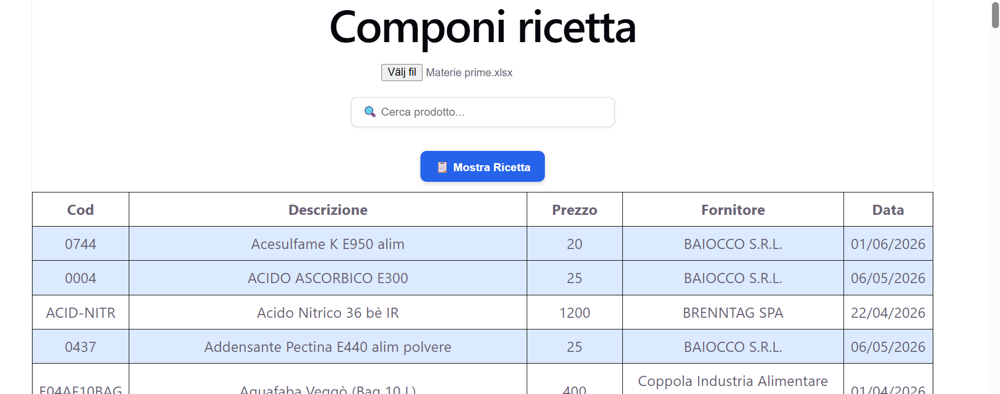
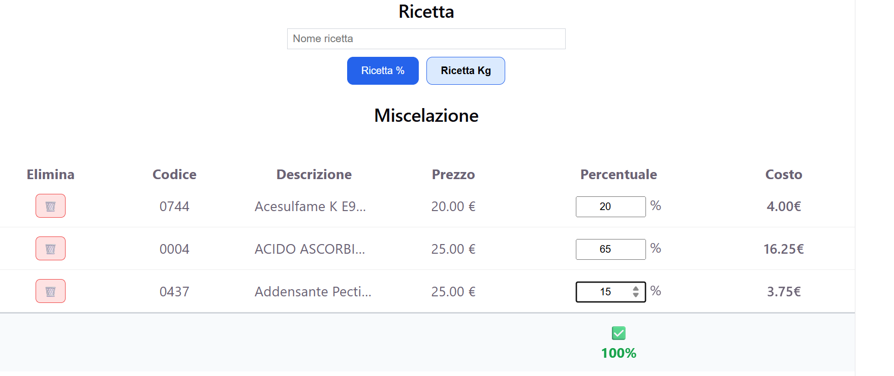
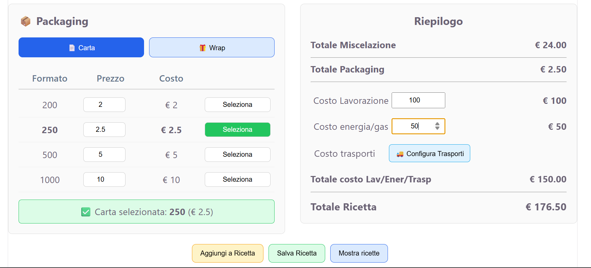
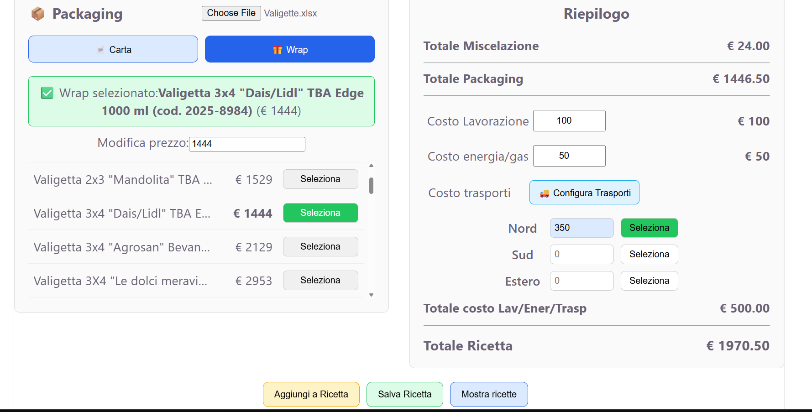
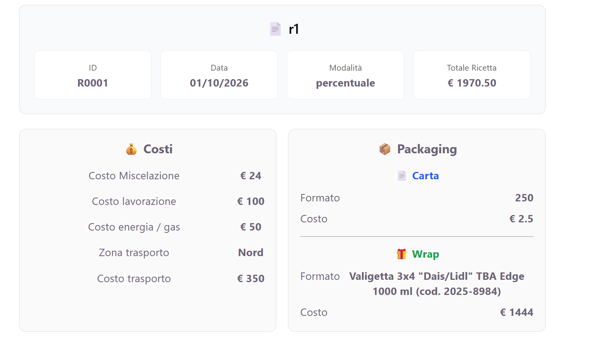
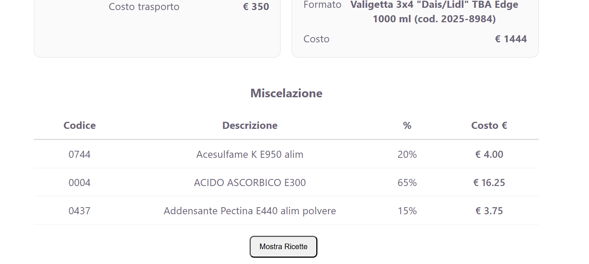
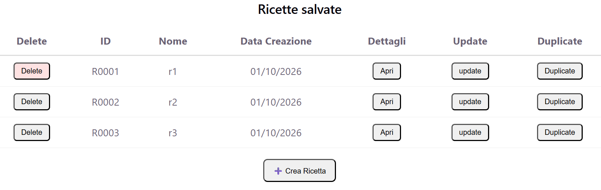

# 🌰 Mandorle Cost Tool

**A desktop application for managing recipes, calculating production costs, and organizing raw materials and packaging expenses.**

Mandorle Cost Tool is a Windows desktop application designed to simplify recipe creation and cost management for food production.

The application allows users to manage raw materials, calculate recipe costs using percentage-based or weight-based methods, track additional production expenses, and save recipes for future reference.

Built with Electron, React, and TypeScript, the application combines a responsive interface with local data persistence.

---

## 📋 Table of Contents

- [Overview](#-overview)
- [Features](#-features)
- [Technologies](#-technologies)
- [Screenshots](#-screenshots)
- [Installation](#-installation)
- [Development](#-development)
- [Building the Application](#-building-the-application)
- [How to Use](#-how-to-use)
- [Data Persistence](#-data-persistence)
- [Project Structure](#-project-structure)
- [Contributing](#-contributing)
- [License](#-license)

---

## 🎯 Overview

Mandorle Cost Tool helps users calculate the cost of production recipes by combining raw material prices, ingredient quantities, packaging expenses, transportation costs, and other production costs.

It is particularly useful for businesses that need to maintain an organized recipe database and quickly calculate production expenses.

The application runs locally on Windows and stores its data in JSON files.

---

## ✨ Features

### Recipe Management

- Create, save, update, **duplicate**, and delete recipes.
- Automatically generate unique recipe IDs.
- Prevent duplicate recipe names.
- Load existing recipes and reuse their ingredients.
- Validate recipe data before saving.
- Display recipe details, including ingredient costs and additional expenses.

### Recipe Calculation

Two calculation modes are available:

**Percentage Mode**

- Assign a percentage to each selected ingredient.
- Enforce a maximum total of 100%.
- Automatically calculate ingredient costs.

**Weight Mode (KG)**

- Enter the weight of each ingredient.
- Automatically calculate ingredient percentages based on total weight.
- Recalculate percentages when ingredients are added or removed.

### Production Costs

Manage additional expenses separately from raw material costs:

- Labor costs.
- Energy and gas costs.
- Transportation costs (North, South, and International).
- Primary packaging costs.
- Secondary packaging (Wrap) costs.

The application calculates additional expenses and combines them with raw material costs to determine the total recipe cost.

### Packaging Management

- Manage primary packaging formats and their prices.
- Import secondary packaging options from an Excel file.
- Edit packaging prices directly from the interface.
- Save packaging configurations for future sessions.
- Select packaging options for individual recipes.

### Data Validation

- Prevent recipes from exceeding 100% in percentage mode.
- Verify that every selected ingredient has a valid quantity or percentage.
- Prevent saving recipes with missing ingredient costs.
- Validate recipe names and prevent duplicates.

### User Experience

- Persistent application state while navigating between pages.
- Custom numeric inputs with decimal support.
- Empty input fields when the value is zero.
- Visual indication of selected transportation and packaging options.
- Native Electron confirmation dialogs for destructive actions.

---

## 🛠 Technologies

| Technology   | Purpose                                         |
| ------------ | ----------------------------------------------- |
| Electron     | Desktop application framework                   |
| React        | User interface                                  |
| TypeScript   | Type safety                                     |
| Node.js      | Main-process operations                         |
| Vite         | Development and build tooling                   |
| Electron IPC | Communication between renderer and main process |
| JSON         | Local data persistence                          |
| Excel        | Packaging data import                           |

---

## 📸 Screenshots

### Recipe Builder









### Recipe Details





### Recipe List



---

## 📦 Installation

### Prerequisites

Before running the application in development mode, install:

- [Node.js](https://nodejs.org/) (LTS recommended)
- npm (included with Node.js)
- Git

### Clone the repository

```bash
git clone https://github.com/Al3za/materie-prime-app.git
```

Navigate to the project directory:

```bash
cd mandorle-cost-tool
```

Install dependencies:

```bash
npm install
```

---

## 💻 Development

Start the application in development mode:

```bash
npm run dev
```

The application will launch using the development configuration.

---

## 🏗 Building the Application

To generate the Windows desktop application:

```bash
npm run dist
```

The build process packages the application using Electron Builder.

The generated files are available in the `release/` directory.

Depending on the build configuration, the output includes the Windows executable and its packaged application resources.

**Note:** The application should be tested on the target Windows environment before distribution.

---

## 📖 How to Use

### 1. Manage Raw Materials

Add or import raw materials and their purchase prices.

Each material has an identifier, description, and purchase price.

### 2. Create a Recipe

Navigate to Recipe Builder and select the ingredients required for the recipe.

Choose one of the available calculation modes:

- Percentage
- KG

### 3. Enter Ingredient Quantities

In percentage mode, assign a percentage to each ingredient.

In KG mode, enter the weight of each ingredient. The application automatically calculates the corresponding percentages.

### 4. Configure Additional Costs

Enter the applicable production expenses:

- Labor
- Energy and gas
- Transportation
- Primary packaging
- Secondary packaging

Select the relevant transportation and packaging options.

### 5. Review the Total Cost

The application calculates:

- Total raw material cost
- Total additional costs
- Final recipe cost

### 6. Save the Recipe

Enter a recipe name and save it.

The application generates a unique recipe ID and stores the recipe for future reference.

### 7. Update or Duplicate Recipes

From Recipe List, users can:

- Open an existing recipe.
- Update its ingredients and costs.
- Duplicate a recipe to create a new variation.
- Delete recipes after confirmation.

---

## 💾 Data Persistence

Mandorle Cost Tool uses local JSON files to persist application data.

Depending on the configured data directory, the application stores information such as:

| Data            | Description                                                 |
| --------------- | ----------------------------------------------------------- |
| `recipes.json`  | Saved recipes and their calculated costs                    |
| `settings.json` | Persistent application settings, including packaging prices |
| Materials data  | Raw material information                                    |
| Wrap data       | Secondary packaging options and prices                      |

The application uses Electron's main process and IPC handlers to read and write local data.

This allows information to remain available after closing and reopening the application.

**Important:** Back up the application's data directory regularly to prevent accidental data loss.

---

## 📁 Project Structure

The project is organized around the Electron main process, preload bridge, and React renderer.

A simplified structure:

```text
mandorle-cost-tool/
├── docs/
│   ├── screenshots/
│   │    ├── RecipeBuilder/
│   │    │    ├── recipe-builder1.png
│   │    │    ├── recipe-builder2.png
│   │    │
│   │    ├── RecipeDetails/
│   │    │   └── recipe-details1.png
│   │    │   └── recipe-details2.png
│   │    │
│   │    ├── RecipeList/
│   │    │    └── ...
│   │    │
├── electron/
│   ├── main.ts
│   └── preload.ts
│
├── src/
│   ├── components/
│   │   ├── MaterialsTable.tsx
│   │   └── RecipeDetail.tsx
│   │   ├── RecipeList.tsx
│   │   ├── UploadExcel.tsx
│   │
│   ├── context/
│   │   ├── RecipeContext.tsx
│   │
│   ├── pages/
│   │   ├── CreateRecipe.tsx
│   │   ├── DuplicateRecipe.tsx
│   │   ├── Home.tsx
│   │   ├── inputToText.tsx
│   │   ├── RecipeBuilder.tsx
│   │
│   └── types/
│   │   ├── cartItem.tsx
│   │   ├── electron.d.ts
│   │   ├── material.js
│   │   ├── material.ts
│   │   ├── material.ts
│   │   ├── settings.ts
│   │   ├── wrap.ts
│   │
│   ├── App.css
│   ├── App.tsx
│   ├── index.css
│   ├── main.tsx
│   │
├── copy-electron-package.cjs
├── package.json
├── tsconfig.json
├── vite.config.ts
└── README.md
```

---

## 🤝 Contributing

Contributions, bug reports, and suggestions are welcome.

If you would like to contribute:

1. Fork the repository.

2. Create a feature branch.

   ```bash
   git checkout -b feature/your-feature
   ```

3. Commit your changes.

   ```bash
   git commit -m "Add your feature"
   ```

4. Push your branch.

   ```bash
   git push origin feature/your-feature
   ```

5. Open a Pull Request describing your changes.

For significant changes, consider opening an issue first to discuss the proposed implementation.

---

## 📄 License

No license has been specified yet.

If you intend to distribute this project as open source, add an appropriate license file (for example, MIT) and update this section accordingly.

---

**Developed with ❤️ using Electron, React, and TypeScript.**
